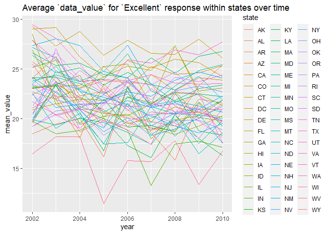

p8105_hw3_zl3386
================
Ziqiu Liu
2023-10-08

``` r
library(tidyverse)
library(ggridges)
library(patchwork)

knitr::opts_chunk$set(
  fig.width = 6,
  fig.asp = .6,
  out.width = "90%"
)

theme_set(theme_minimal() + theme(legend.position = "bottom"))

options(
  ggplot2.continuous.colour = "viridis",
  ggplot2.continuous.fill = "viridis"
)

scale_colour_discrete = scale_colour_viridis_d
scale_fill_discrete = scale_fill_viridis_d
```

## Problem 1

This problem uses the Instacart data.

``` r
library(p8105.datasets)
data("instacart")

instacart = 
  instacart |> 
  as_tibble()
```

Write a short description of the dataset, noting the **size** and
**structure** of the data, describing some **key variables**, and giving
illstrative **examples** of observations.

- The data has 1384617 rows and 15 columns. Each row represents a
  product (with id `product_id`) from an instacart order (with id
  `order_id`). Other variables include the order in which the item was
  added to cart (`add_to_cart_order`), whether or not the item has been
  ordered by the user before (`reordered`), customer identifier
  (`user_id`), etc. A product is identified by its `product_name`
  (e.g. Bulgarian Yogurt, Cucumber Kirby), its `aisle` name
  (e.g. yogurt, fresh vegetables) and id (`aisle_id`), and its
  `department` (e.g. dairy eggs, produce).

- Below is a table summarizing the number of items ordered from aisle.
  In total, there are 134 aisles, with fresh vegetables and fresh fruits
  holding the most items ordered by far.

``` r
instacart |> 
  count(aisle) |> 
  arrange(desc(n))
```

    ## # A tibble: 134 × 2
    ##    aisle                              n
    ##    <chr>                          <int>
    ##  1 fresh vegetables              150609
    ##  2 fresh fruits                  150473
    ##  3 packaged vegetables fruits     78493
    ##  4 yogurt                         55240
    ##  5 packaged cheese                41699
    ##  6 water seltzer sparkling water  36617
    ##  7 milk                           32644
    ##  8 chips pretzels                 31269
    ##  9 soy lactosefree                26240
    ## 10 bread                          23635
    ## # ℹ 124 more rows

- Next is a plot that shows the number of items ordered in each aisle.
  Here, aisles are ordered by ascending number of items.

``` r
instacart |> 
  count(aisle) |> 
  filter(n > 10000) |> 
  mutate(aisle = fct_reorder(aisle, n)) |> 
  ggplot(aes(x = aisle, y = n)) + 
  geom_point() + 
  labs(title = "Number of items ordered in each aisle") +
  theme(axis.text.x = element_text(angle = 60, hjust = 1))
```


- Our next table shows the three most popular items in aisles
  `baking ingredients`, `dog food care`, and
  `packaged vegetables fruits`, including the number of times each item
  is ordered.

``` r
instacart |> 
  filter(aisle %in% c("baking ingredients", "dog food care", "packaged vegetables fruits")) |>
  group_by(aisle) |> 
  count(product_name) |> 
  mutate(rank = min_rank(desc(n))) |> 
  filter(rank < 4) |> 
  arrange(desc(n)) |>
  knitr::kable()
```

| aisle                      | product_name                                  |    n | rank |
|:---------------------------|:----------------------------------------------|-----:|-----:|
| packaged vegetables fruits | Organic Baby Spinach                          | 9784 |    1 |
| packaged vegetables fruits | Organic Raspberries                           | 5546 |    2 |
| packaged vegetables fruits | Organic Blueberries                           | 4966 |    3 |
| baking ingredients         | Light Brown Sugar                             |  499 |    1 |
| baking ingredients         | Pure Baking Soda                              |  387 |    2 |
| baking ingredients         | Cane Sugar                                    |  336 |    3 |
| dog food care              | Snack Sticks Chicken & Rice Recipe Dog Treats |   30 |    1 |
| dog food care              | Organix Chicken & Brown Rice Recipe           |   28 |    2 |
| dog food care              | Small Dog Biscuits                            |   26 |    3 |

- Finally is a table showing the mean hour of the day at which Pink Lady
  Apples and Coffee Ice Cream are ordered on each day of the week. This
  table has been formatted in an untidy manner for human readers. Pink
  Lady Apples are generally purchased slightly earlier in the day than
  Coffee Ice Cream, with the exception of day 5.

``` r
instacart |>
  filter(product_name %in% c("Pink Lady Apples", "Coffee Ice Cream")) |>
  group_by(product_name, order_dow) |>
  summarize(mean_hour = mean(order_hour_of_day)) |>
  pivot_wider(
    names_from = order_dow, 
    values_from = mean_hour) |>
  knitr::kable(digits = 2)
```

    ## `summarise()` has grouped output by 'product_name'. You can override using the
    ## `.groups` argument.

| product_name     |     0 |     1 |     2 |     3 |     4 |     5 |     6 |
|:-----------------|------:|------:|------:|------:|------:|------:|------:|
| Coffee Ice Cream | 13.77 | 14.32 | 15.38 | 15.32 | 15.22 | 12.26 | 13.83 |
| Pink Lady Apples | 13.44 | 11.36 | 11.70 | 14.25 | 11.55 | 12.78 | 11.94 |

## Problem 2

This problem uses the BRFSS data.

``` r
library(p8105.datasets)
data("brfss_smart2010")
```

First, do some data cleaning:

``` r
brfss_df = 
  brfss_smart2010 |>
  # format the data to use appropriate variable names
  janitor::clean_names() |> 
  rename(state = locationabbr, location = locationdesc) |>
  # focus on the "Overall Health” topic
  filter(topic == "Overall Health") |>
  # include only responses from “Excellent” to “Poor”
  filter(response %in% c("Excellent", "Very good", "Good", "Fair", "Poor" )) |>
  # organize responses as a factor taking levels ordered from “Poor” to “Excellent”
  mutate(response = factor(response, levels = c("Poor", "Fair", "Good", "Very good", "Excellent")))
```

Using this dataset, do or answer the following (commenting on the
results of each):

In 2002, which states were observed at 7 or more locations? What about
in 2010?

``` r
brfss_df |>
  filter(year == 2002) |>
  group_by(state) |>
  count(location) |> 
  count(state) |>
  filter(n >= 7)
```

    ## # A tibble: 6 × 2
    ## # Groups:   state [6]
    ##   state     n
    ##   <chr> <int>
    ## 1 CT        7
    ## 2 FL        7
    ## 3 MA        8
    ## 4 NC        7
    ## 5 NJ        8
    ## 6 PA       10

``` r
brfss_df |>
  filter(year == 2010) |>
  group_by(state) |>
  count(location) |> 
  count(state) |>
  filter(n >= 7)
```

    ## # A tibble: 14 × 2
    ## # Groups:   state [14]
    ##    state     n
    ##    <chr> <int>
    ##  1 CA       12
    ##  2 CO        7
    ##  3 FL       41
    ##  4 MA        9
    ##  5 MD       12
    ##  6 NC       12
    ##  7 NE       10
    ##  8 NJ       19
    ##  9 NY        9
    ## 10 OH        8
    ## 11 PA        7
    ## 12 SC        7
    ## 13 TX       16
    ## 14 WA       10

- In 2002, there were 6 states (CT, FL, MA, NC, NJ, PA) that were
  observed at 7 or more locations; while in 2010, this number had
  increased to 14.

Construct a dataset that is limited to `Excellent` responses, and
contains year, state, and a variable that averages the `data_value`
across locations within a state. Make a “spaghetti” plot of this average
value over time within a state (that is, make a plot showing a line for
each state across years

``` r
excellent_df =
  filter(brfss_df, response == "Excellent") |>
  select(year, state, data_value) |>
  group_by(state, year) |>
  mutate(mean_value = mean(data_value)) |>
  select(-data_value) |>
  unique() |>
  arrange(state, year)

excellent_df |>
  ggplot(aes(x = year, y = mean_value, color = state)) +
  geom_line(aes(group = state))
```

    ## Warning: Removed 3 rows containing missing values (`geom_line()`).



Make a two-panel plot showing, for the years 2006, and 2010,
distribution of `data_value` for responses (“Poor” to “Excellent”) among
locations in NY State.

``` r
brfss_df |>
  filter(year %in% c(2006, 2010), state == "NY") |>
  select(year, location, response, data_value) |>
  ggplot(aes(x = response, y = data_value, color = location)) +
  geom_line(aes(group = location)) +
  facet_grid(. ~ year)
```


